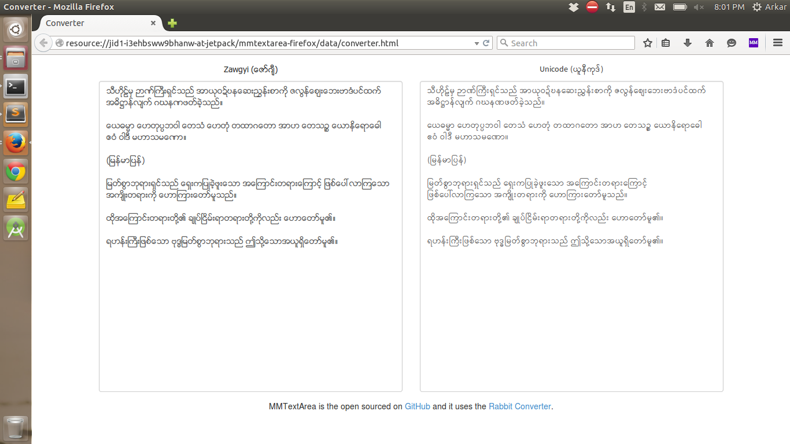

# MMTextArea-Firefox

MMTextArea-Firefox is built on top of Rabbit converter

## Install

Install directly from firefox addon : [MMTextArea-Firefox](https://addons.mozilla.org/en-US/firefox/addon/mmtextarea-firefox/)

[OR]

You can download the [zip](https://github.com/Arkar-Aung/MMTextArea-Firefox/archive/master.zip) file and unzip it.

1. Go to Tools > Addons.
2. Select "Install Add-on From File.." (By clicking setting icon on top of addons list)
3. Select the "mmtextarea-firefox.xpi" file
4. MMTextArea will be installed and ready to use.

## Credits

It uses the [Rabbit Converter](https://github.com/Rabbit-Converter/Rabbit).

## Contributing

1. Fork it (https://github.com/Arkar-Aung/MMTextArea-Firefox)
2. Create your feature branch (`git checkout -b my-new-feature`)
3. Commit your changes (`git commit -am 'Added some feature'`)
4. Push to the branch (`git push origin my-new-feature`)
5. Create new Pull Request

## License

MIT
